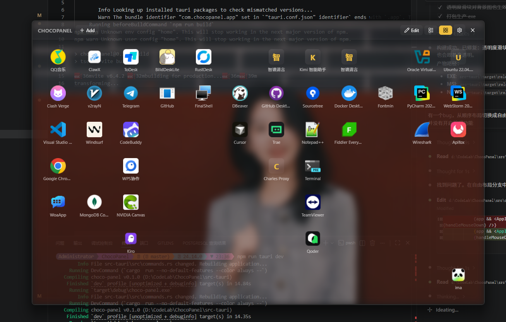

# ChocoBar



一个基于 Tauri v2 的轻量级 Windows 快速启动面板。按 `Ctrl + Space` 即可在屏幕最顶层显示浮动面板，再按一次隐藏，也可按 `Esc` 隐藏。

> **[下载 ChocoBar v0.1.0](https://tuziki.com/demo/chocobar/ChocoBar_0.1.0.exe)**

[English](./README_EN.md)

## 功能特性

- **快速切换**: 按 `Ctrl + Space` 显示面板，再按一次隐藏，或按 `Esc` 隐藏
- **自定义快捷键**: 在设置中录制任意键盘组合作为面板切换快捷键
- **系统托盘**: 后台运行，托盘图标支持右键菜单（设置、关于、检查更新、退出）
- **应用发现**: 自动扫描 Windows 注册表和开始菜单中已安装的应用
- **搜索添加**: 按关键词搜索应用并固定到面板
- **网格布局**: 两种布局模式 —— 顺序填充和自由拼贴
- **编辑模式**: 拖拽排列应用图标，拖拽窗口边缘调整大小
- **桌面拖放**: 从桌面拖入 `.exe` / `.lnk` 文件直接添加应用（仅编辑模式）
- **自定义背景**: 上传图片作为面板背景，支持拉伸、平铺、居中三种填充模式，可调节高斯模糊和透明度
- **持久化存储**: 固定应用、布局模式、透明度、背景图等设置自动保存

## 技术栈

| 层级 | 技术 |
|------|------|
| 框架 | Tauri v2 |
| 后端 | Rust (edition 2021) |
| 前端 | React 18 + TypeScript |
| 构建工具 | Vite 6 |
| 状态管理 | Zustand 5 |
| 拖拽 | 鼠标事件自定义拖拽 |
| 图标 | Lucide React |

## 快速开始

### 环境要求

- Windows 10/11
- [Node.js](https://nodejs.org/) v18+
- [Rust](https://www.rust-lang.org/tools/install)（stable）
- [Tauri 依赖](https://v2.tauri.app/start/prerequisites/)

### 安装与运行

```bash
# 安装前端依赖
npm install

# 启动开发模式（带热重载）
npm run tauri dev

# 生产构建
npm run tauri build
```

### 使用方法

1. 启动 ChocoBar，系统托盘出现图标
2. 按 `Ctrl + Space`（或自定义快捷键）显示面板，再按一次隐藏
3. 点击「Add」按钮搜索并添加应用
4. 点击「Edit」进入编辑模式，可拖拽排列图标、拖拽窗口边缘调整大小
5. 按 `Esc` 或点击关闭按钮隐藏面板
6. 右键托盘图标可打开设置、关于、检查更新或退出

## 项目结构

```
ChocoPanel/
├── src/                        # React 前端
│   ├── components/             # UI 组件
│   │   ├── Panel.tsx           # 面板主组件
│   │   ├── Toolbar.tsx         # 顶部工具栏
│   │   ├── AppGrid.tsx         # 网格布局（含拖拽、自动计算行列）
│   │   ├── AppIcon.tsx         # 单个应用图标
│   │   ├── SearchModal.tsx     # 搜索模态框
│   │   ├── SettingsModal.tsx   # 设置面板
│   │   ├── AboutModal.tsx      # 关于对话框
│   │   └── UpdateModal.tsx     # 更新检查对话框
│   ├── store/
│   │   └── useAppStore.ts      # Zustand 状态管理
│   ├── styles/                 # CSS 样式
│   ├── types/
│   │   └── index.ts            # TypeScript 类型定义
│   └── utils/
│       └── grid.ts             # 网格计算工具函数
├── src-tauri/                  # Rust 后端
│   └── src/
│       ├── main.rs             # 入口点
│       ├── lib.rs              # Tauri 应用构建器
│       ├── app_scanner.rs      # Windows 应用扫描
│       ├── commands.rs         # IPC 命令处理器
│       ├── shortcut.rs         # 全局快捷键（双击检测）
│       ├── state.rs            # 状态持久化
│       ├── tray.rs             # 系统托盘
│       └── icon_extractor.rs   # 应用图标提取
└── docs/                       # 文档
```

## 许可证

MIT
